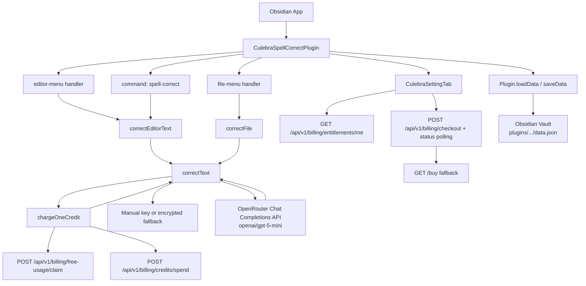
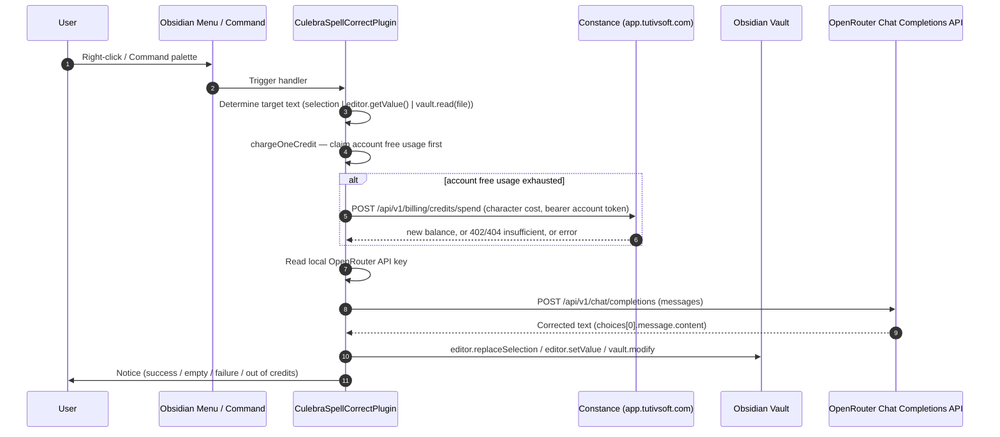

# Culebra Obsidian AI Auto Correct Spelling — Architecture

Code audit: 2026-09-23 (plugin release 4.4.17). Documentation and release metadata refreshed 2026-09-24 for 4.4.18; runtime implementation is unchanged.
From code audit of: `main.ts`, `manifest.json`, `package.json`, `esbuild.config.mjs`, `scripts/*`, `styles.css`.

## 1. Component Architecture



The plugin is a single TypeScript module (`main.ts`) that registers three entry surfaces — editor context menu, file explorer context menu, and a command palette entry — all converging on one private `correctText` helper. It previews the result before applying it, then charges `ceil(input characters / 1000)` credits before calling OpenRouter with the configured provider.

## 2. Data Flow

### 2.1 Spell correction request (selection / whole note / whole file)



### 2.2 Credit purchase and balance sync

```mermaid
sequenceDiagram
    autonumber
    participant U as User
    participant P as CulebraSettingTab
    participant B as Browser (window.open)
    participant C as Constance (app.tutivsoft.com)
    U->>P: Click "Buy $1 / $5 / $15"
    P->>C: POST /api/v1/billing/checkout (plan_code + Idempotency-Key)
    C-->>P: checkout_url + checkout_id, or fallback condition
    alt checkout URL returned
        P->>B: window.open checkout_url
        loop every 15s, 6 attempts
            P->>C: GET /api/v1/billing/checkouts/{checkout_id}
        end
    else no checkout URL
        P->>B: window.open legacy GET /buy?app_id=...&price_id=...
    end
    B->>C: Paddle checkout flow (external to the plugin)
    loop every 15s, 6 attempts after checkout opens; also on load and settings-tab open
        P->>C: GET /api/v1/billing/entitlements/me (bearer account token)
        C-->>P: credits.balance
        P->>P: settings.purchasedCredits = balance; saveData
    end
```

Identity is an authenticated Constance account token plus the plugin's
installation id. Registration/login links that installation to the account;
the password is used only for the request and is never persisted. This prevents
reinstalling the plugin from creating a new free allowance or spending another
user's credits.

## 3. Data Model

The plugin persists a single setting object through Obsidian's `Plugin.loadData` / `saveData`:

### Settings (`CulebraSettings`)
- `model: string` — defaults to `openai/gpt-5-mini` (OpenRouter model id).
- `constanceDeviceId: string` — random per-install id (`crypto.getRandomValues`), doubles as Constance's `external_customer_id`/`machine_id`. Generated once in `onload()` if empty.
- `billingEmail: string` — the account email used for sign-in and the legacy checkout fallback.
- `billingAccessToken: string` — saved bearer session token; cleared when invalid.
- `billingAccountLinked: boolean` — true only after Constance links this installation.
- `freeCredits: number` — local display mirror of the account-scoped allowance returned by Constance.
- `purchasedCredits: number` — local mirror of the authenticated Constance `CreditBalance`.

The `apiKey` field is supplied by the user and stored in the vault's local plugin data. It is used only as the authorization credential for OpenRouter requests and is never bundled into the release.

### Plugin metadata (manifest.json)
- `id`: `culebra-ai-spell-correct`
- `name`: `Culebra AI Spell Correct`
- `version`: `4.4.18`
- `minAppVersion`: `1.5.0`
- `isDesktopOnly`: `false`

### Build artifacts (npm scripts)
- `npm run build` — `tsc -noEmit -skipLibCheck && node esbuild.config.mjs production` (compile + bundle).
- `npm run dev` — `node esbuild.config.mjs` (esbuild watch/dev).
- `npm run deploy:vault` — build + copy `main.js`, `manifest.json`, `styles.css` into the Obsidian vault.
- `npm run test:api` — `node scripts/test-openrouter-spell-correct.mjs` (uses `OPENROUTER_API_KEY` from the environment for a live OpenRouter smoke test).
- `npm run test:vault-plugin` — `node scripts/test-vault-plugin-install.mjs` (also asserts no plaintext OpenAI/OpenRouter key is bundled in the deployed install).

## 4. Routing Surface

This is an Obsidian plugin — there is no HTTP routing. Entry surfaces:

- **Editor right-click menu:** `editor-menu` event → `Culebra AI Spell Correct`.
- **File explorer right-click menu:** `file-menu` event on `.md` files → `Culebra AI Spell Correct`.
- **Command palette:** `id: spell-correct`, `name: Correct selection or current note`.
- **Settings tab:** `CulebraSettingTab` exposes an `OpenRouter API key` field, `Model`, a combined free+purchased credits display, billing account controls including verification, three `Buy $1/$5/$15` buttons, and a `Refresh balance` button.

## 5. External Dependencies

Runtime (declared in `devDependencies` of `package.json`, `obsidian` provides the host bindings at runtime):
- `obsidian ^1.8.7` — Plugin API, `requestUrl`, Editor, TFile, Notice, PluginSettingTab.
- `@types/node ^24.0.0`
- `esbuild ^0.27.0` — bundler
- `typescript ^5.9.3`
- `tslib ^2.8.1`
- `builtin-modules ^5.0.0`

External services:
- OpenRouter Chat Completions API (`https://openrouter.ai/api/v1/chat/completions`), model `openai/gpt-5-mini` default. OpenAI-compatible request/response shape. Authenticated with the user-supplied local key.
- Constance / TutivSoft central billing (`https://app.tutivsoft.com`) — authenticated account registration/login/verification, installation linking, entitlement reads, free-usage claims, credit spends, catalog-code checkout, and checkout-status polling under `/api/v1/auth/*` and `/api/v1/billing/*`; `/buy` is a legacy fallback only.

Vault target:
- The configured Obsidian vault plugin directory for plugin id `culebra-ai-spell-correct`.

## 6. Operational Notes

- `VERSION` = `4.4.18`; `package.json` and `publish/manifest.json` carry the same version.
- The OpenRouter key is entered by the user and stored in local plugin data. It is never bundled into the plugin source or release JavaScript.
- Constance's three live one-time catalog prices remain mapped to the $1/$5/$15 packs. The Buy buttons send catalog plan codes (`standard`, `pro`, `ultimate`) to authenticated checkout with idempotency and poll settlement; the stored Paddle price ids are used only by the legacy `/buy` fallback.
- The `start.sh` metadata entry-point intentionally documents the boot path and exits 0; the actual operational command is `npm run deploy:vault` per `package.json`.
